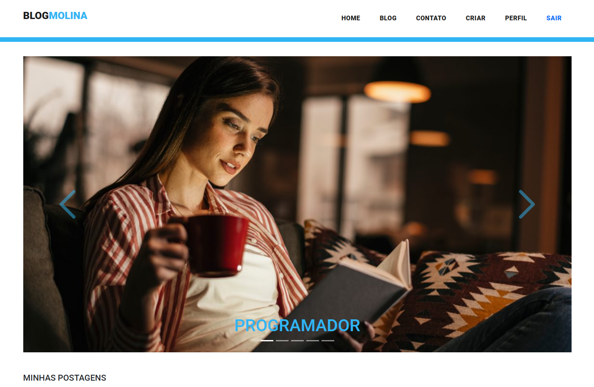
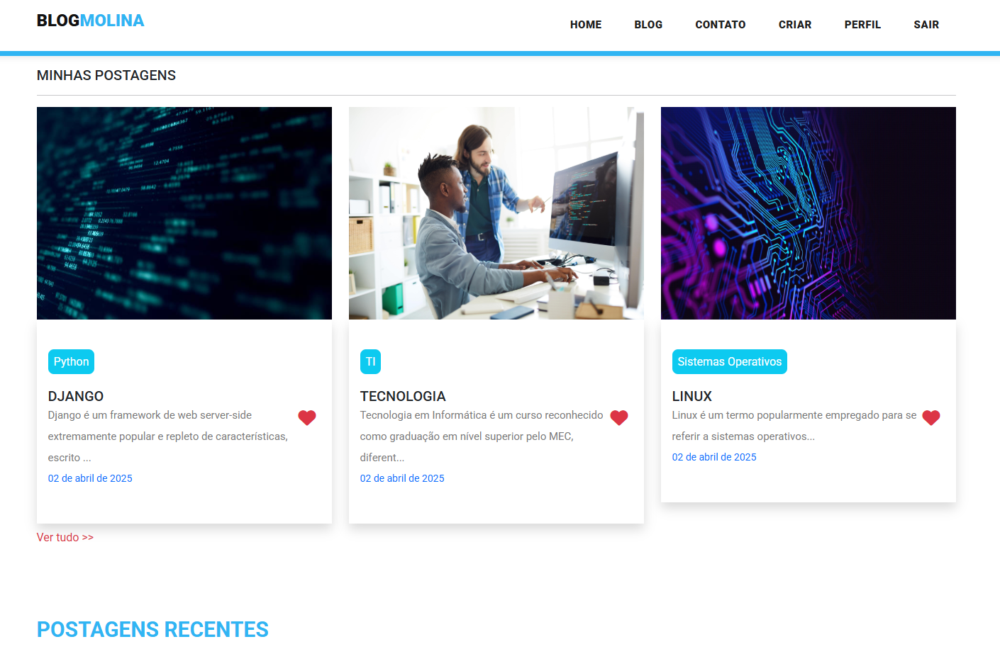
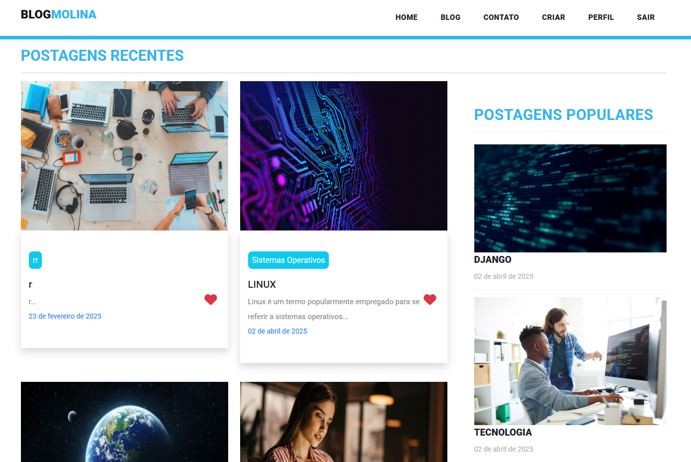
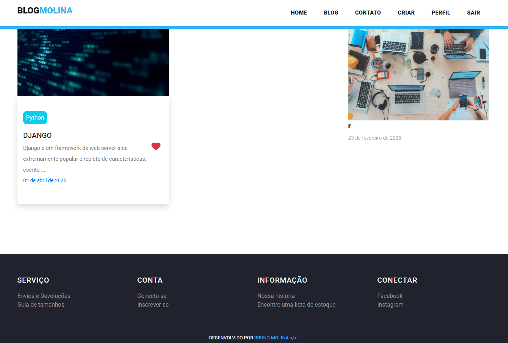
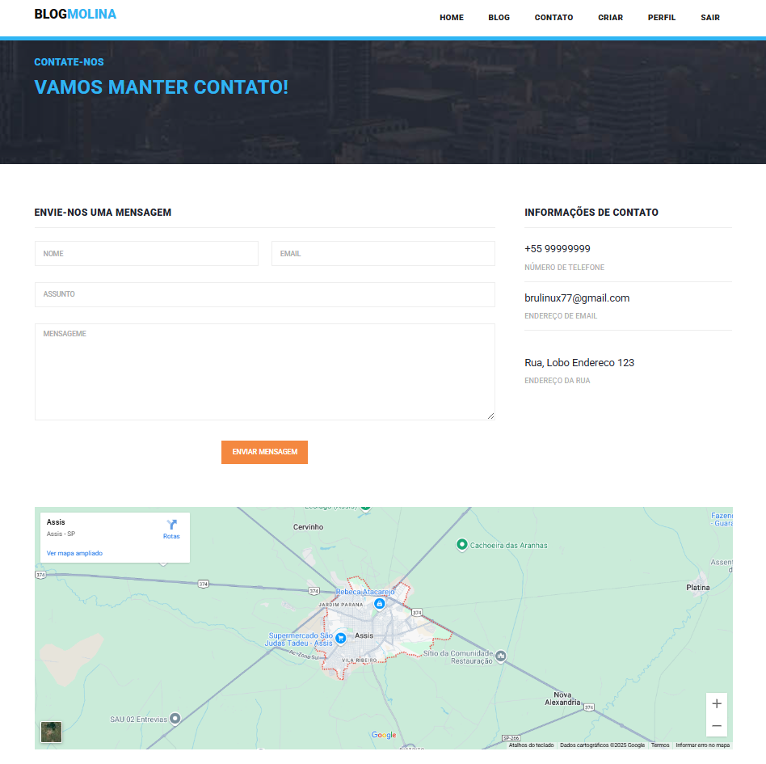
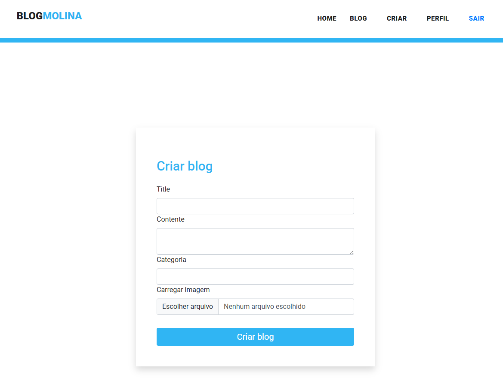
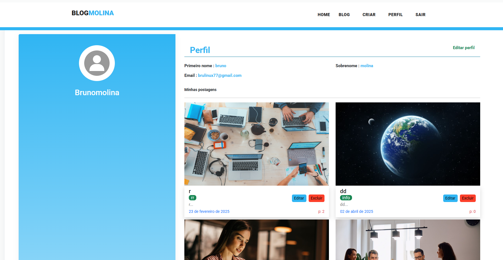
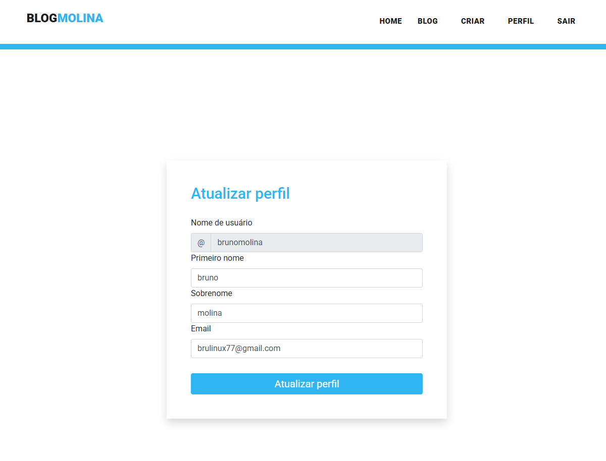
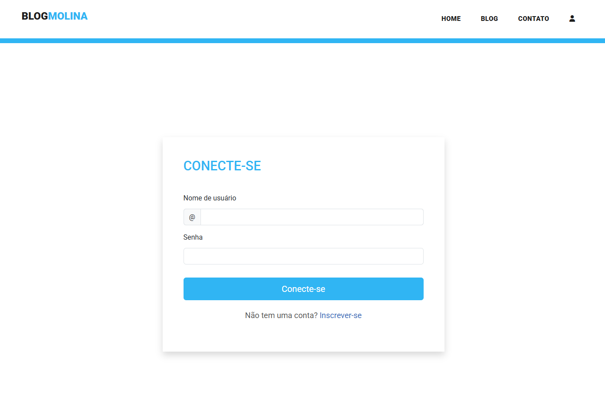
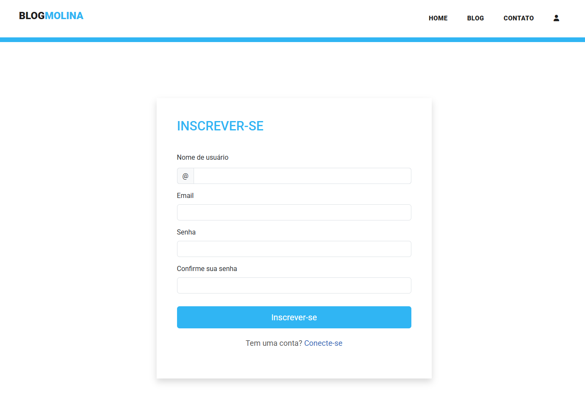

<div align="center">

  <h1 align="center">Django Blog</h1>

## 📃 Descrição


Site de Blog
Um aplicativo de blog desenvolvido com Django contém todos os recursos essenciais de um site de blog, incluindo sistema de login e registro de usuários, criação de postagens com título, descrição e imagem, além da possibilidade de editar ou excluir postagens. O sistema também conta com um painel de administração, permitindo o gerenciamento de todas as postagens e usuários de forma centralizada.


📸 Preview

  <a href="https://python-dj.onrender.com/"><strong>➥ Link </strong></a>
  https://python-dj.onrender.com/

</div>

<br>











<br>

## Características / Features 


- **Gerenciamento de Blog** – Este recurso permite realizar operações CRUD (Criar, Ler, Atualizar e Excluir) em postagens de blog, possibilitando adicionar, editar e remover conteúdos.
- **Sistema de Login** – O administrador pode acessar o sistema através do login e gerenciar todos os seus recursos.
- **Blog** – Representa a funcionalidade principal do sistema, onde as postagens são criadas e exibidas.
- **Mídia** – Nesta seção, é possível visualizar e gerenciar todos os arquivos de mídia carregados no sistema.
- **Modelo** – Refere-se à estrutura e ao design do sistema, desenvolvidos utilizando HTML, CSS e JavaScript, Bootstrap


## 🛠 Construído com 

- HTML
- CSS
- JavaScript
- Python
- Django
- Database
- Bootstrap


(Português)
O sistema foi desenvolvido totalmente com o Django Framework no back-end e HTML, CSS no front-end. Ele possui uma interface de usuário completa com todas as funcionalidades.


## ⭐️ Mostre seu apoio! 


Este é um projeto feito com Django e deployado no Render.

## Funcionalidades
- [x] Cadastro/Login
- [x] CRUD completo
- [x] Deploy em produção


Deixe um ⭐️ se você gostou deste projeto!


## 👨‍💻 Autor

- [GitHub](https://github.com/brumab) | [LinkedIn](https://www.linkedin.com/in/brumab1122/) | [cv](https://brumab.github.io/cur/)


## Como rodar local
```bash
git clone https://github.com/brumab/PYTHON_DJ.git
cd PYTHON_DJ
pip install -r requirements.txt
python manage.py runserver


